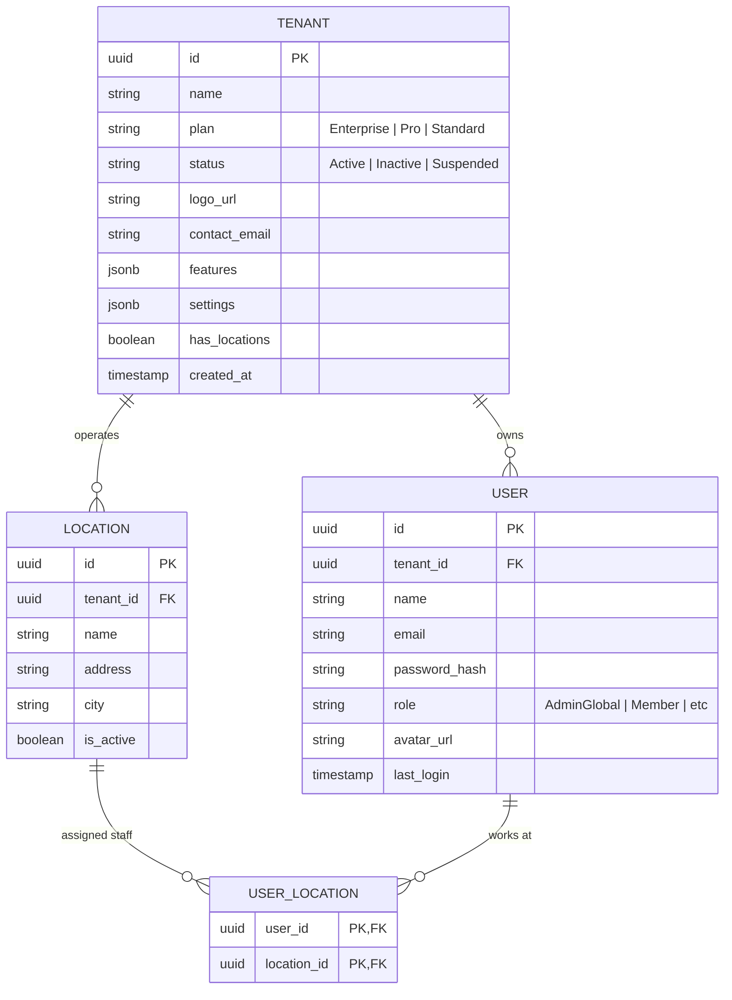
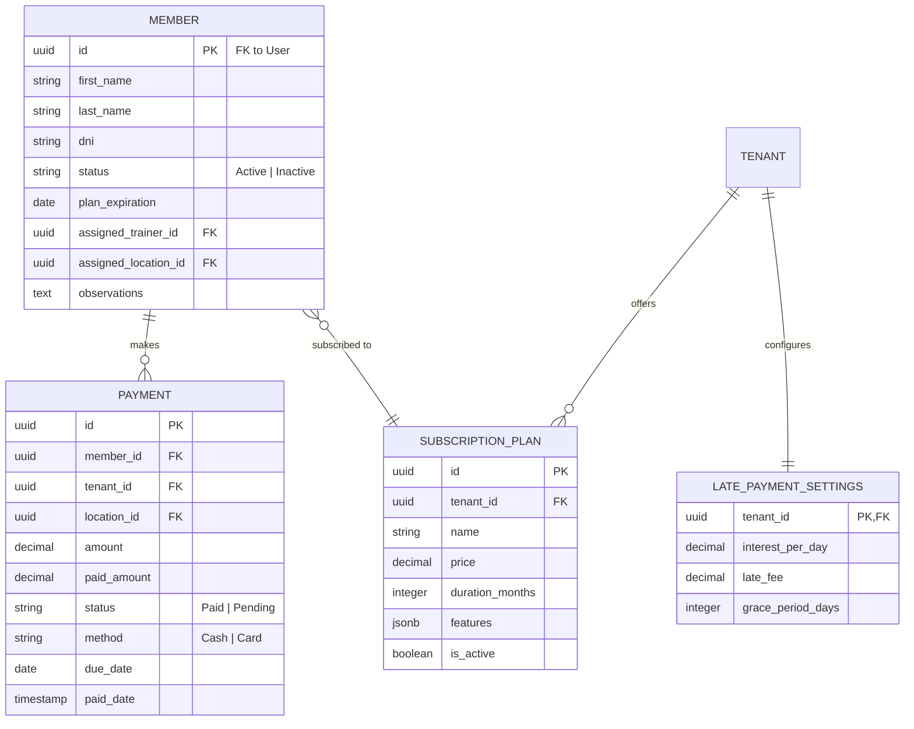
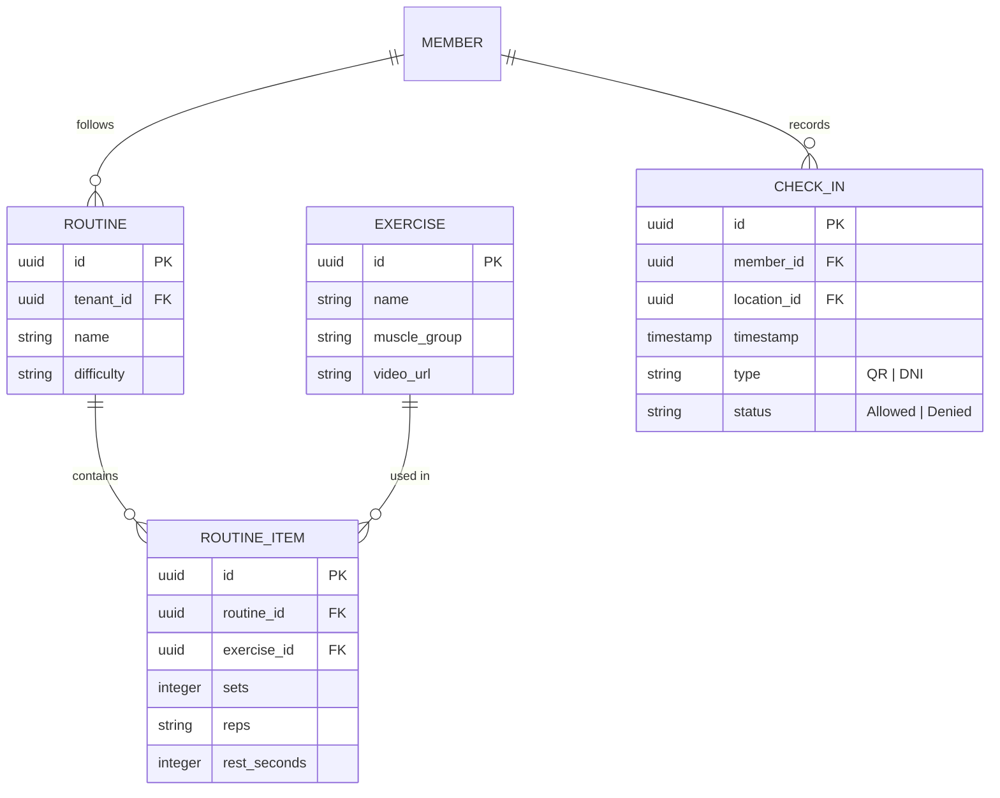
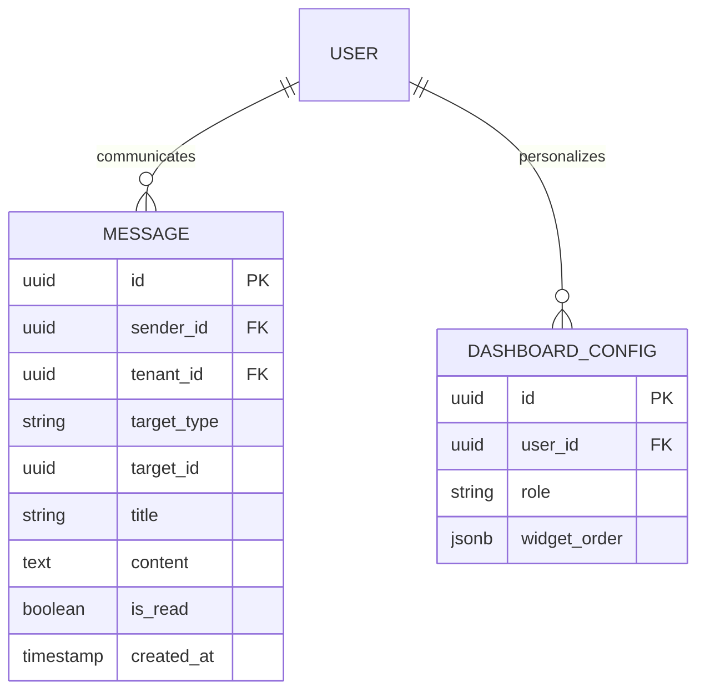
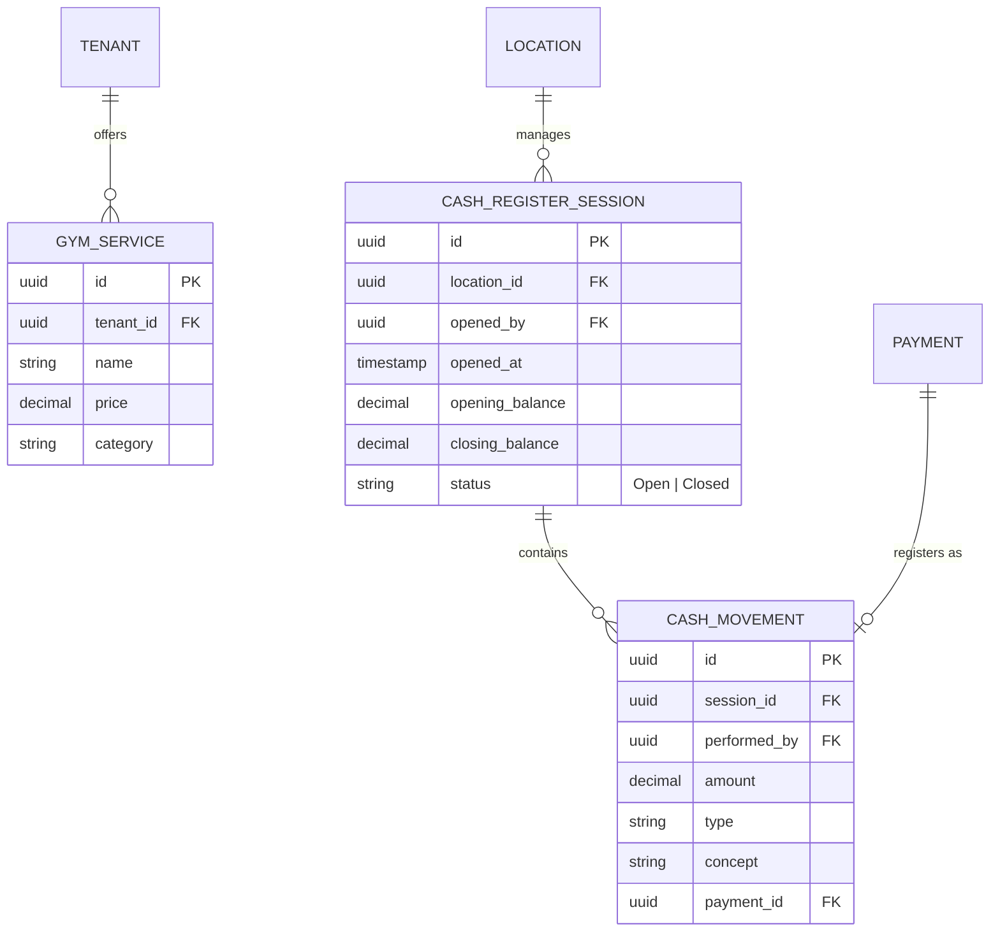

# GymOS Backend Schema Design (NestJS + PostgreSQL)

This document outlines the database structure and entity relationships for the GymOS back-end, optimized for multi-tenancy and high performance.

## 1. Core & Auth Module

### Tables: `tenants`, `users`, `locations`



## 2. Membership & Finance Module

### Tables: `members`, `subscription_plans`, `payments`, `late_payment_settings`



## 3. Training & Performance Module

### Tables: `exercises`, `routines`, `routine_items`, `check_ins`



## 4. Operational & UI Module

### Tables: `classes`, `class_sessions`, `messages`, `user_dashboard_configs`



## 5. Operations & Logistics

### Tables: `gym_services`, `cash_register_sessions`, `cash_movements`



## 6. NestJS Implementation Details

### Recommended Project Structure

```text
src/
├── app.module.ts
├── common/             # Interceptors, Filters, Guards
├── modules/
│   ├── auth/           # Passport, JWT
│   ├── tenant/         # Tenants & Locations
│   ├── user/           # Users & Dashboard Configs
│   ├── membership/     # Members, Plans & Payments
│   ├── training/       # Routines & Exercises
│   └── scheduler/      # Classes & Sessions
└── database/
    └── migrations/     # TypeORM/Prisma migrations
```

### Key Technical Decisions

1.  **Multi-tenancy**: Use a **Shared Database + Discriminator Column (`tenant_id`)**. It is the most scalable approach for SaaS.
2.  **JSONB**: Used for `dashboard_configs` and `tenant_features` to allow UI flexibility without frequent schema migrations.
3.  **Soft Deletes**: Implement `deleted_at` across critical tables (Users, Members, Plans) to preserve financial history.
4.  **Indexes**: Ensure composite indexes on `(tenant_id, id)` and `(member_id, status)` for fast filtering.
